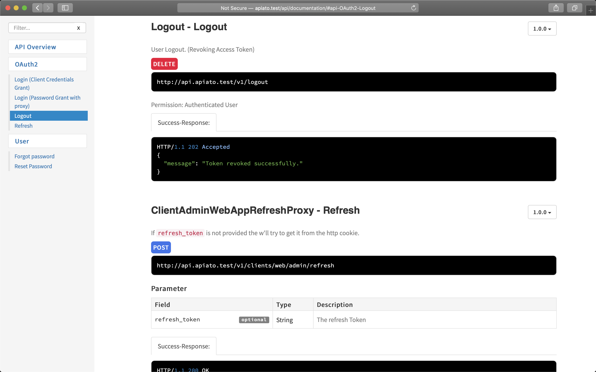
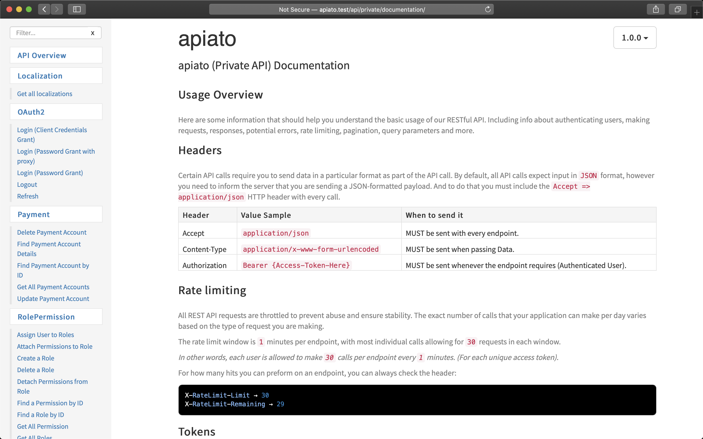

- [Requirements](#requirements)
- [Usage](#usage)
    - [1- Write a PHP **docblock** on top of your endpoint like this:](#write-a-php-docblock-on-top-of-your-endpoint-like-this)
    - [2- Run the documentation generator command from the root directory:](#run-the-documentation-generator-command-from-the-root-directory)
    - [3- Visit this URL's as shown in your terminal:](#visit-this-urls-as-shown-in-your-terminal)
  - [Generate Swagger/OpenAPI JSON schema from apiDoc](#generate-swagger-openapi-json-schema-from-apidoc)
  - [Error: ApiDoc not found !!](#error-apidoc-not-found)
  - [Shared response for faster updating and less outdated responses:](#shared-response-for-faster-updating-and-less-outdated-responses)
- [Documentation Customization](#documentation-customization)
  - [Edit the default generated values in the templates:](#edit-the-default-generated-values-in-the-templates)
  - [Change the Documentations URL's](#change-the-documentations-urls)
  - [Edit the Documentation Header](#edit-the-documentation-header)

Every great API needs a great Documentation.

Apiato make writing and generating documentations very easy with the `php artisan apiato:apidoc` command.

Alternatively you can generate a swagger doc from the apidoc comments, to do so run `php artisan apiato:swagger` command.

:::danger ATTENTION

This container is a `VendorContainer` and is installed with apiato by default,
to modify its code you need to read [the instructions](#documentation-customization) first.

:::

## Requirements {#requirements}

- Install the [ApiDocJs](http://apidocjs.com/) tool, the project directory
    - (`npm install apidoc`)

- (Recommended) read the [Routes](../main-components/routes) page first.

## Usage {#usage}

#### 1 - Write a PHP **docblock** on top of your endpoint like this: {#write-a-php-docblock-on-top-of-your-endpoint-like-this}

*For more info about the parameters check out [ApiDocJs](http://apidocjs.com/#install) documentation*

```php
/**
 * @apiGroup           Authentication
 * @apiName            UserLogin
 * @api                {post} /users/login User Login
 * @apiDescription     Description Here....
 * @apiVersion         1.0.0
 * @apiPermission      none
 *
 * @apiHeader          Accept application/json
 *
 * @apiParam           {String}     email
 * @apiParam           {String}     password
 *
 * @apiSuccessExample  {json}       Success-Response:
 *   HTTP/1.1 200 OK
 *   {
 *     "data": {
 *       "id": "owpzanmh",
 *       "name": "Super Admin",
 *       "email": "admin@admin.com"
 *       ...
 *   }
 *
 * @apiErrorExample  {json}       Error-Response:
 *   {
 *      "message":"401 Credentials Incorrect.",
 *      "status_code":401
 *   }
 *
 * @apiErrorExample  {json}       Error-Response:
 *   {
 *      "message":"Invalid Input.",
 *      "errors":{
 *         "email":[
 *            "The email field is required."
 *         ]
 *      },
 *      "status_code":422
 *   }
 */

$router->post('users/login', [
    'uses' => 'Controller@userLogin',
]);
```

**Note:** All the Endpoints `DocBlocks` MUST be written inside Routes files, otherwise they won't be loaded.

#### 2 - Run the documentation generator command from the root directory: {#run-the-documentation-generator-command-from-the-root-directory}

```shell

php artisan apiato:apidoc

```

#### 3 - Visit this URL's as shown in your terminal: {#visit-this-urls-as-shown-in-your-terminal}

- Public (external) API at [http://apiato.test/api/documentation/](http://apiato.test/api/documentation/).



- Private (internal) API at [http://apiato.test/api/private/documentation/](http://apiato.test/api/private/documentation/).



**NOTE:** Every time you change the DocBlock of a Route file you need to run the `apiato:apidoc` command, to regenerate.

### Generate Swagger/OpenAPI JSON schema from apiDoc {#generate-swagger-openapi-json-schema-from-apidoc}

It's also possible to generate a Swagger/OpenAPI JSON schema from apiDoc with:

```shell

php artisan apiato:swagger

```

You can find the JSON schema at [http://apiato.test/api/private/documentation/swagger/swagger.json](http://apiato.test/api/private/documentation/swagger/swagger.json)

### Error: ApiDoc not found !! {#error-apidoc-not-found}

If you get an error (`apidoc not found`),

1. open the container config file `Containers/Documentation/Configs/apidoc.php`

2. edit the `executable` path to **`$(npm bin)/apidoc`** or to however you access the `apidoc` tool on your machine.

```php    /*
    |--------------------------------------------------------------------------
    | Executable
    |--------------------------------------------------------------------------
    |
    | Specify how you run or access the `apidoc` tool on your machine.
    |
    */

    'executable' => 'apidoc',
```

### Shared response for faster updating and less outdated responses: {#shared-response-for-faster-updating-and-less-outdated-responses}

To prevent duplicating the responses between routes, let's create a shared response for each object.

Example: `_user.v1.public.php` will contain all responses (single, multiple...) of the User:

```php
/**
 * @apiDefine UserSuccessSingleResponse
 * @apiSuccessExample {json} Success-Response:
HTTP/1.1 200 OK
{
   "data":{
      "object":"User",
      "id":eqwja3vw94kzmxr0,
   },
   "meta":{
      "include":[],
      "custom":[]
   }
}
 */
```

**Usage of the shared User response from any endpoint:**

 ```php
* @apiUse UserSuccessSingleResponse
 ```

To avoid having to generate and update the Single and Multiple responses of the same object (recommended only for private API's)
you can use the general shared Multiple Response `* @apiUse GeneralSuccessMultipleResponse`
which you can find and modify it from `app/Containers/Documentation/UI/API/Routes/*`

## Documentation customization {#documentation-customization}

:::caution Instructions

This container works out of the box perfectly but if you want to change its configs or modify the codes you MUST follow these steps first:

1- Copy the container from `VendorSection` to `AppSection` (or any of your custom sections) of your project<br/>
2- Fix any broken namespaces<br/>
3- Update `section_name` & `html_files` in container configs<br/>
4- Update `apidoc.json` files in `ApiDocJs/private` & `public` folders and fix the `filename`<br/>

```json
{
    "header": {
        "filename": "Containers/NEW_SECTION_NAME/Documentation/UI/WEB/Views/documentation/header.md"
    }
}
```

:::

### Edit the default generated values in the templates: {#edit-the-default-generated-values-in-the-templates}

Apiato generates by defaults 2 API documentations, each one has its own `apidoc.json` file. Both can be modified from the Documentation Containers in `Containers/Documentation/ApiDocJs/`

`apidoc.json` Example file:

```json
{
  "name": "Apiato",
  "description": "Apiato (Private API) Documentation",
  "title": "Welcome to Apiato",
  "version": "1.0.0",
  "url" : "http://api.apiato.test",
  "template": {
    "withCompare": true,
    "withGenerator": true
  },
  "header": {
    "title": "API Overview",
    "filename": "app/Containers/Documentation/ApiDocJs/private/header.md"
  },
  "footer": {
    "title": "Footer",
    "filename": "app/Containers/Documentation/ApiDocJs/private/header.md"
  },
  "order": [

  ]
}
```

### Change the Documentations URL's {#change-the-documentations-urls}

Edit the config file of the Documentation Container `Containers/Documentation/Configs/apidoc.php`

```php
return [

    /*
    |--------------------------------------------------------------------------
    | Executable
    |--------------------------------------------------------------------------
    |
    | Specify how you run or access the `apidoc` tool on your machine.
    |
    */

    'executable' => 'apidoc',

    /*
    |--------------------------------------------------------------------------
    | API Types
    |--------------------------------------------------------------------------
    |
    | The `types` helps generating multiple documentations, by grouping them
    | under types names. You can add or remove any type. By default
    | `public` and `private` types are set.
    |
    | url: The url to access that generated API documentation.
    |
    | routes: The route file to read when generating this documentation.
    |         Every route file will have the following name format:
    |         `{endpoint-name}.v{version-number}.{documentation-type}.php`.
    |
    */

    'types' => [

        'public' => [
            'url' => 'api/documentation',
            'routes' => [
                'public',
            ],
        ],

        'private' => [
            'url' => 'api/private/documentation',
            'routes' => [
                'private',
                'public',
            ],
        ],
    ],


    /*
    |--------------------------------------------------------------------------
    | HTML files
    |--------------------------------------------------------------------------
    |
    | Specify where to put the generated HTML files.
    |
    */

    'html_files' => 'public/'


    // ...
];
```

### Edit the Documentation Header {#edit-the-documentation-header}

The header is usually the Overview of your API. It contains Info about authenticating users, making requests, responses, potential errors, rate limiting, pagination, query parameters and anything you want.

All this information is written in `app/Containers/Documentation/ApiDocJs/shared/header.template.md` file, and the same file is used as header for both private and public documentations.

To edit the content just open the markdown file in any markdown editor and edit it.

You will notice some variables like `{{rate-limit}}` and `{{token-expires}}`. Those are replaced when running `apidoc:generate` with real values from your application configuration files.

Feel free to extend them to include more info about your API from the `app/Containers/Documentation/Actions/ProcessMarkdownTemplatesAction.php` class.
