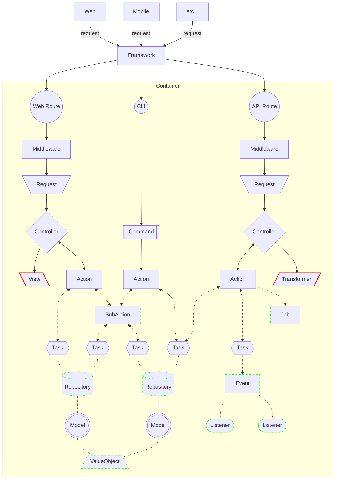

When using any tool in the "real world", you feel more confident if you understand how that tool works.
Application development is no different.
When you understand how your development tools function, you feel more comfortable and confident using them.

The following steps describe a basic API call scenario:

1. The User calls an `Endpoint` in a `Route` file.
2. `Endpoint` calls a `Middleware` to handle the Authentication.
3. `Endpoint` calls its corresponding `Controller` function.
4. The `Request` object, which is injected in the `Controller`, applies the request validation and authorization rules.
5. `Controller` calls an `Action` and passes the data from the `Request` object to it.
6. `Action` executes the business logic or call as many `Tasks` as needed.
7. `Tasks` execute reusable subsets of the business logic.
8. `Action` prepares the data to be returned to the `Controller`, and may collect data from the `Tasks` if needed.
9. `Controller` builds the response using a `View` or `Transformer`, and sends it back to the User.

It is important to note that the `Request` object handles request validation and authorization rules,
while the `Action` executes the business logic.
The `Tasks` can be used to execute reusable subsets of the business logic,
with each `Task` responsible for a single portion of the main `Action`.
The `View` or `Transformer` is used to build the response that is sent back to the User.

## Request Lifecycle Diagram

[//]: # "TODO: Update the diagram to reflect the new architecture, specially after adding DTOs. API, Web and CLI can use the same Actions and DTOs, but the Controllers and Requests are different."

#### Legend:

- Solid Line: Mandatory dependency (always used)
- Doted Line: Optional dependency (not always used)
- Red Solid Border: Response generation
- Green Dashed Border: Optional component (not always used)

