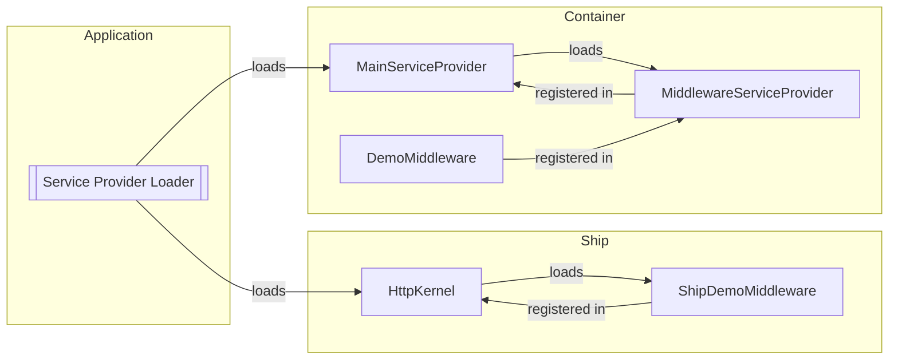

Apiato middlewares are just [Laravel Middlewares](https://laravel.com/docs/middleware),
and they function in the exact same way as Laravel middlewares.
However, they come with additional rules and conventions specific to Apiato.

To generate new middlewares
you may use the `apiato:generate:middleware` interactive command:

```
php artisan apiato:generate:middleware
```

## Rules

- All container-specific Middlewares:
  - MUST be placed in the `app/Containers/{Section}/{Container}/Middlewares` directory.
  - MUST be registered in their respective container's `App\Containers\{Section}\{Container}\Providers\MiddlewareServiceProvider` class.
- All general Middlewares:
  - MUST be placed in the `app/Ship/Middlewares` directory.
  - MUST be registered in the `App\Ship\Kernels\HttpKernel` class.
- All non-Laravel or third-party package Middlewares MUST extend the `App\Ship\Parents\Middlewares\Middleware` class.
  - The parent extension SHOULD be aliased as `ParentMiddleware`.

## Folder Structure

The highlighted sections showcase middleware registration points:

```php
app
├── Containers
│   └── Section
│       └── Container
│           ├── Middlewares
│           │   ├── DemoMiddleware.php
│           │   └── ...
│           └── Providers
                // highlight-start
│               ├── MiddlewareServiceProvider.php
                // highlight-end
│               └── ...
└── Ship
    ├── Kernels
        // highlight-start
    │   └── HttpKernel.php
        // highlight-end
    └── Middlewares
        ├── AnotherMiddleware.php
        └── ...
```

## Code Example

Middlewares are defined exactly as you would define them in Laravel.

## Registering Middleware

The registration process for a middleware varies depending on its intended scope within the application.
Different places are designated for different levels of middleware usage.

In essence, the decision of where to register a middleware boils down to two key factors:
the scope of middleware usage and the logical location for its registration.

### Container Middlewares

If a middleware usage is specific to a container,
it must be registered in the `App\Containers\{Section}\{Container}\Providers\MiddlewareServiceProvider` class.

```php
use ...
use App\Ship\Parents\Providers\MiddlewareServiceProvider as ParentMiddlewareServiceProvider;

class MiddlewareServiceProvider extends ParentMiddlewareServiceProvider
{
    protected array $middlewares = [];
    protected array $middlewareGroups = [];
    protected array $middlewarePriority = [];
    protected array $middlewareAliases = [];
}
```

To generate a middleware service provider
you may use the `apiato:generate:provider` interactive command:

```
php artisan apiato:generate:provider
```

Remember to also register the `MiddlewareServiceProvider` in the container's `MainServiceProvider`:

```php
use ...
use App\Ship\Parents\Providers\MainServiceProvider as ParentMainServiceProvider;

class MainServiceProvider extends ParentMainServiceProvider
{
    protected array $serviceProviders = [
        // ... Other service providers
        MiddlewareServiceProvider::class,
    ];
}
```

### General Middlewares

General middlewares must be registered in the `App\Ship\Kernels\HttpKernel` class.

### Third Party Middlewares

When dealing with third-party packages that require middleware registration in the `App\Ship\Kernels\HttpKernel` class,
you should follow these guidelines:

- **Specific Container Usage**: If the package is used within a particular container, register its middleware in that container `App\Containers\{Section}\{Container}\Providers\MiddlewareServiceProvider` class.

- **Framework-wide Usage**: If the package is generic and used throughout the entire application, you can register its middleware in the `App\Ship\Kernels\HttpKernel` class.

## Middleware Registration Flow

If you want to understand the middleware registration process,
here is a breakdown of the registration flow.

Consider the following folder structure:

```php
app
├── Containers
│   └── Section
│       └── Container
│           ├── Middlewares
│           │   ├── DemoMiddleware.php ─►─┐
│           │   └── ...                   │
│           └── Providers                 ▼
│               ├── MiddlewareServiceProvider.php ─────►─────┐
│               ├── MainServiceProvider.php ◄─registered─in─◄┘
│               └── ...
└── Ship
    ├── Kernels
    │   ├── HttpKernel.php ◄─registered─in─◄┐
    │   └── ...                             │
    └── Middlewares                         │
        ├── AnotherMiddleware.php ─────►────┘
        └── ...
```

The following diagram illustrates the registration flow of middlewares in the above folder structure:


