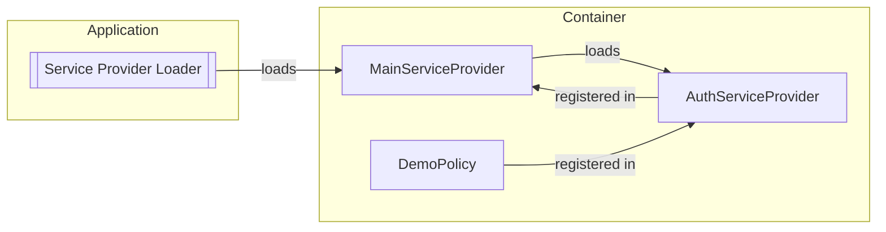

Apiato policies are just [Laravel Policies](https://laravel.com/docs/authorization),
and they function in the exact same way as Laravel policies.
However, they come with additional rules and conventions specific to Apiato.

To generate new policies you may use the `apiato:generate:policy` interactive command:

```
php artisan apiato:generate:policy
```

## Rules

- All Policies:
  - MUST be placed in the `app/Containers/{section}/{container}/Policies` directory.
  - MUST extend the `App\Ship\Parents\Policies\Policy` class.
    - The parent extension SHOULD be aliased as `ParentPolicy`.
  - MUST be named after the model they are associated with, followed by the `Policy` suffix. For instance, `UserPolicy.php`.


## Folder Structure

The highlighted section showcases the policy registration point:

```php
app
└── Containers
    └── Section
        └── Container
            ├── Policies
            │   ├── UserPolicy.php
            │   └── ...
            └── Providers
                // highlight-start
                ├── AuthServiceProvider.php
                // highlight-end
                └── ...
```

## Code Example

Policies are defined exactly as you would define them in Laravel.

## Registering Policies

Once the policy class has been created, it needs to be registered.
Registering policies is
how we can inform Apiato which policy to use when authorizing actions against a given model type.

Registering policies can be done
by adding them to the `policies` array in the `App\Containers\{Section}\{Container}\Providers\AuthServiceProvider` class.

```php
use ...
use App\Ship\Parents\Providers\AuthServiceProvider as ParentAuthProvider;

class AuthServiceProvider extends ParentAuthProvider
{
    protected $policies = [
        Post::class => PostPolicy::class,
    ];
}
```

To generate an event service provider
you may use the `apiato:generate:provider` interactive command:

```
php artisan apiato:generate:provider
```

Remember to also register the `AuthServiceProvider` in the container's `MainServiceProvider`:

```php
use ...
use App\Ship\Parents\Providers\MainServiceProvider as ParentMainServiceProvider;

class MainServiceProvider extends ParentMainServiceProvider
{
    protected array $serviceProviders = [
        // ... Other service providers
        AuthServiceProvider::class,
    ];
}
```

### Policy Auto-Discovery

Apiato offers a policy auto-discovery feature that eliminates the need for manual registration of model policies.
This automatic discovery process relies on adhering to standard Apiato naming conventions for both models and policies.

By following the [rules](#rules) outlined above, you allow Apiato to automatically discover your policies.

To summarize:

- Policies must be stored within the `app/Containers/{section}/{container}/Policies` directory.
- The policy name should mirror the corresponding model's name while appending a `Policy` suffix. For instance, a `User` model corresponds to a `UserPolicy` policy class.

## Policy Registration Flow

In case you are going to register your policies manually, and don't want to use the auto-discovery feature,
you may want to understand the policy registration process.
Here is a breakdown of the registration flow.

Consider the following folder structure:

```php
app
└── Containers
    └── Section
        └── Container
            ├── Policies
            │   ├── DemoPolicy.php ─►─┐
            │   └── ...               │
            └── Providers             ▼
                ├── AuthServiceProvider.php ─────────►───────┐
                ├── MainServiceProvider.php ◄─registered─in─◄┘
                └── ...

```

The following diagram illustrates the registration flow of policies in the above folder structure:



## Helper Methods

> This feature is available since Apiato v12.2.0.

All models are equipped with the `owns` and `isOwnedBy` methods,
made available through the `Apiato\Core\Traits\CanOwnTrait` trait.
These methods offer a convenient way to determine if a model is owned by another model or if a model owns another model.

These methods support all types of relationships, as demonstrated below:

```php
// Check if a user owns a post
$user->owns($post);

// Check if a post is owned by a user
$post->isOwnedBy($user);
```
