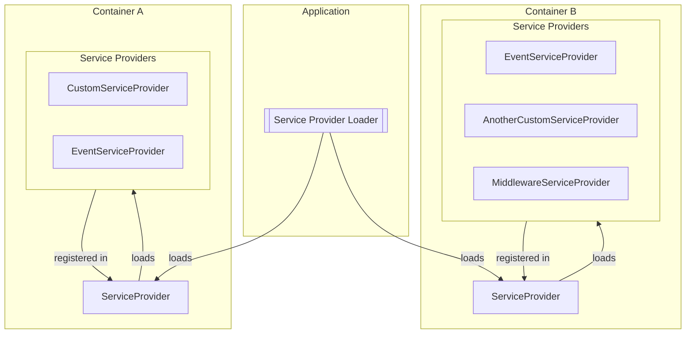

Apiato service providers are just [Laravel Service Providers](https://laravel.com/docs/providers),
and they function in the exact same way as Laravel service providers.
However, they come with additional rules and conventions specific to Apiato.

To generate new service providers
you may use the `apiato:make:provider` interactive command:

```
php artisan apiato:make:provider
```

There are two distinct types of service providers within a container:
the `Main Service Provider` and additional service providers.
The Main Service Provider serves as the central registration point for all custom service providers within the container.
It orchestrates the setup and integration of these custom providers,
ensuring the seamless functioning of your application's components.

## Rules

- You MUST NOT register any Service Provider in the `config/app.php` (except Laravel default service providers).
- Each Container:
  - MAY have one or many Service Providers.
- All container-specific Service Providers:
  - MUST be placed in the `app/Containers/{Section}/{Container}/Providers` directory.
- All general Service Providers:
  - MUST be placed in the `app/Ship/Providers` directory.
- All Service Providers:
  - MUST extend the `App\Ship\Parents\Providers\ServiceProvider` class.
  - The parent extension SHOULD be aliased as `ParentServiceProvider`.
- When using Laravel [default service providers](#laravel-service-providers):
  - `AuthServiceProvider` MUST extend `App\Ship\Parents\Providers\AuthServiceProvider`.
  - `BroadcastServiceProvider` MUST extend `App\Ship\Parents\Providers\BroadcastServiceProvider`.
  - `EventServiceProvider` MUST extend `App\Ship\Parents\Providers\EventServiceProvider`.
  - `MiddlewareServiceProvider` MUST extend `App\Ship\Parents\Providers\MiddlewareServiceProvider`.
  - `RouteServiceProvider` MUST extend `App\Ship\Parents\Providers\RouteServiceProvider`.
  - The parent extension SHOULD be aliased as `Parent{ServiceProviderName}`. For example: `ParentAuthServiceProvider`.

## Folder Structure

The highlighted sections showcase service provider registration points:

- `ServiceProvider.php` acts as the central registration point for custom service providers specific to a container.
- `ShipServiceProvider.php` acts as the central registration point for the Ship (general) service providers.

```php
app
├── Containers
│   └── Section
│       └── Container
│           └── Providers
│               ├── AuthServiceProvider.php
│               ├── BroadcastServiceProvider.php
│               ├── EventServiceProvider.php
                // highlight-start
│               ├── ServiceProvider.php
                // highlight-end
│               ├── MiddlewareServiceProvider.php
│               ├── RouteServiceProvider.php
│               ├── CustomServiceProvider.php
│               └── ...
└── Ship
    └── Providers
        ├── RouteServiceProvider.php
        // highlight-start
        ├── ShipServiceProvider.php
        // highlight-end
        └── ...
```

## Code Example

#### Main Service Provider:

```php
use App\Ship\Parents\Providers\ServiceProvider as ParentServiceProvider;

class ServiceProvider extends ParentServiceProvider
{
    public array $serviceProviders = [
        CustomServiceProvider::class,
        MiddlewareServiceProvider::class,
        PassportServiceProvider::class,
    ];

    public array $aliases = [];
}
```

## Register Providers

The registration process for a service provider varies depending on its intended scope within the application.
Different places are designated for different levels of service provider usage.

In essence, the decision of where to register a service provider boils down to two key factors:
the scope of service provider usage and the logical location for its registration.

### Container Service Providers

#### Main Service Provider

A container `Main Service Provider` will be automatically registered by Apiato
so manual registration isn't necessary.
In turn,
Main Service Providers will register all service providers listed in their `$serviceProviders` property.

#### Additional Service Providers

To register a provider,
add the provider's class name to the `serviceProviders` array in the `App\Containers\{Section}\{Container}\Providers\ServiceProvider` class.

```php
public array $serviceProviders = [
    CustomServiceProvider::class,
    AnotherCustomServiceProvider::class,
    EventsServiceProvider::class,
];
```

You can also list aliases in the `$aliases` property of the `App\Containers\{Section}\{Container}\Providers\ServiceProvider` class.

```php
public array $aliases = [
    'CustomAlias' => CustomFacade::class,
    'AnotherCustomAlias' => AnotherCustomFacade::class,
];
```

:::note
If you override the `register` or the `boot` methods in any Service Provider,
you must also call the `parent::register()` and `parent::boot()` methods respectively,
to ensure that anything that needs to be registered or booted in the parent class is done so.
:::

### General Service Providers

General service providers must be registered in the `App\Ship\Providers\ShipServiceProvider` class.
This can be done by adding the provider class name to the `serviceProviders` array.

```php
public array $serviceProviders = [
    CustomServiceProvider::class,
    AnotherCustomServiceProvider::class,
    EventsServiceProvider::class,
];
```

### Third Party Service Providers

When dealing with third-party packages that require service provider registration in `config/app.php`,
you should follow these guidelines:

- **Specific Container Usage**: If the package is used within a particular container, register its service provider in that container `App\Containers\{Section}\{Container}\Providers\ServiceProvider` class.

- **Framework-wide Usage**: If the package is generic and used throughout the entire application, you can register its service provider in the `App\Ship\Prviders\ShipServiceProvider` class. However, avoid registering it directly in `config/app.php`.

## Laravel Service Providers

Apiato introduces a refined organization for Laravel service providers.
By default, Laravel standard service providers,
located in the `app/providers` directory,
have been restructured in Apiato to reside in the `app/Ship/Parents/Providers` directory.

Here's the mapping of Laravel's default service providers to their new locations in Apiato:

- `App\Providers\AppServiceProvider` → `App\Ship\Parents\Providers\ServiceProvider`
  - Note: Laravel `AppServiceProvider` is renamed to `ServiceProvider` in Apiato.
- `App\Providers\AuthServiceProvider` → `App\Ship\Parents\Providers\AuthServiceProvider`
- `App\Providers\BroadcastServiceProvider` → `App\Ship\Parents\Providers\BroadcastServiceProvider`
- `App\Providers\EventServiceProvider` → `App\Ship\Parents\Providers\EventServiceProvider`
- `App\Providers\RouteServiceProvider` → `App\Ship\Parents\Providers\RouteServiceProvider`

You should not modify these providers directly.
Instead, extend them within your container's `Providers` directory.
For instance,
the `App\Containers\AppSection\Authentication\Providers\AuthServiceProvider` class extends `App\Ship\Parents\Providers\AuthServiceProvider`.

Those providers are not auto registered by default,
thus writing any code there will not be available, unless you extend them.
Once extended, the child Service Provider should be registered in its container `ServiceProvider`,
which makes it available.

:::note 
Do note that the `App\Ship\Parents\Providers\RouteServiceProvider` is a unique case.
Because it's required by Apiato, it is registered by the `App\Ship\Prviders\ShipServiceProvider` and is loaded automatically.
:::

## Service Providers Registration Flow

If you want to understand the service provider registration process,
here is a breakdown of the registration flow.

Consider the following folder structure:

```markdown
app
├── Containers
│   └── Section
│       ├── ContainerA
│       │   └── Providers
│       │       ├── CustomServiceProvider.php ─────────►────────┐
│       │       ├── EventServiceProvider.php  ─────────►────────┤
│       │       ├── ServiceProvider.php  ◄──registered─in─◄─┘
│       │       └── ...
│       └── ContainerB
│           └── Providers
│               ├── AnotherCustomServiceProvider.php ────────►────────┐
│               ├── EventServiceProvider.php         ────────►────────┤
│               ├── ServiceProvider.php        ◄──registered─in─◄─┤
│               ├── MiddlewareServiceProvider.php    ────────►────────┘
│               └── ...
└── Ship
    └── Providers
        ├── CustomGeneralServiceProvider.php ────────►────────┐
        ├── RouteServiceProvider.php         ────────►────────┤
        ├── ShipServiceProvider.php               ◄──registered─in─◄─┘
        └── ...
```

The following diagram illustrates the registration flow of service providers in the above folder structure:


