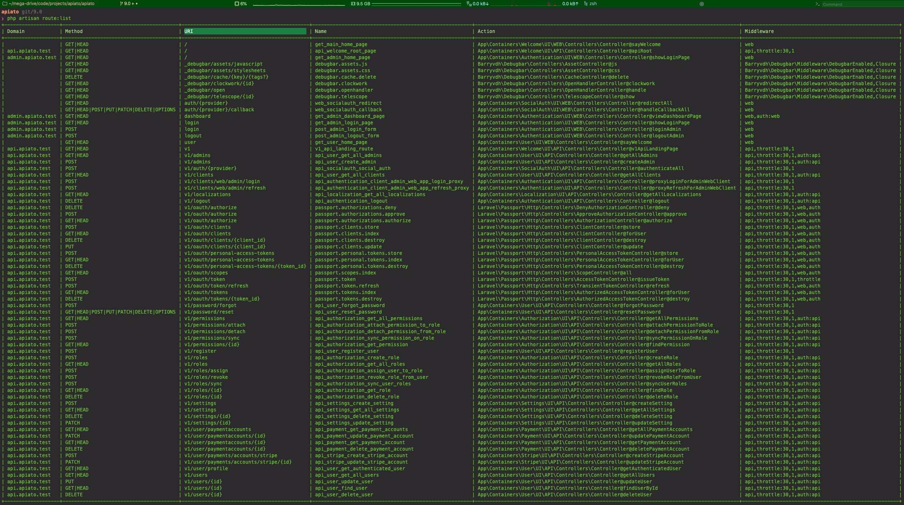

Apiato comes shipped with many **useful** API endpoints for speeding up the development process.

You can see the endpoints in three ways:
- In Terminal, by running `php artisan route:list`.
- In Browser, by generating the beautiful detailed documentation. See the [API Docs Generator](api-docs-generator) page for more details.
- In Code, by navigating to the `Routes` folder of each container's UI.

## Screenshot showing the result of `route:list`:

