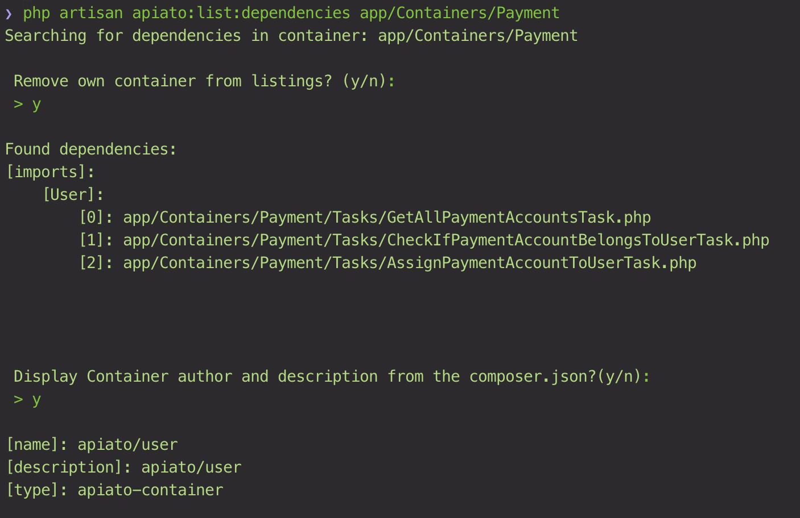

- [Available Commands](#available-commands)
- [List All Actions Command](#list-all-actions-command)
- [List All Tasks Command](#list-all-tasks-command)
- [List Container Dependencies Command](#list-container-dependencies-command)

Apiato is shipped with many useful commands to help you speed up the development process.
You can see list of all commands, by typing `php artisan` and look for **Apiato** section.

## Available Commands {#available-commands}

- `php artisan apiato:list:actions` List all Actions in the Application.
- `php artisan apiato:list:tasks` List all Tasks in the Application.
- `php artisan apiato:list:dependencies {container}` List a Container dependencies.
- `php artisan apiato:encode` Encode a hashed ID.
- `php artisan apiato:permissions:toRole {role-name}` Give all system Permissions to a specific Role.
- `php artisan apiato:seed-test` Seeds your custom testing data from `app/Ship/Seeders/SeedTestingData.php`.
- `php artisan apiato:seed-deploy` Seeds your custom deployment data from `app/Ship/Seeders/SeedDeploymentData.php`.
- `php artisan apiato:apidoc` Generate API Documentations with apidoc from your routes Docblock. [More details]({{ site.baseurl }}).
- `php artisan apiato:swagger` Generate API Documentations with swagger from your routes Docblock. [More details]({{ site.baseurl }}).
- `php artisan apiato:generate:{component}` Generate a specific component for the framework (e.g., `Action`, `Task`, ...). For more details on the `Code Generator` [click here]({{ site.baseurl }}).
- `php artisan apiato` Display the current Apiato version.

## List All Actions Command {#list-all-actions-command}

It's useful to be able to see all the implemented use cases in your application. To do so type
`php artisan apiato:list:actions`

You can also pass `--withfilename` flag to see all Actions with the files names.
`apiato:list:actions --withfilename`


## List All Tasks Command {#list-all-tasks-command}

It's useful to be able to see all the implemented tasks in your application. To do so type
`php artisan apiato:list:tasks`

You can also pass `--withfilename` flag to see all Tasks with the files names.
`apiato:list:tasks --withfilename`

## List Container Dependencies Command {#list-container-dependencies-command}

Sometimes it is required to show dependencies between containers (e.g., how they are _interlinked_ amongst each others).
Apiato provides a command to list all dependencies for one specific container. The command does take the `Apiato::call()` and `$this->call()` (with `use X`) into account.

If you want to get the dependencies for one container, you can call

```bash
php artisan apiato:list:dependencies app/Containers/{container-name}
```


