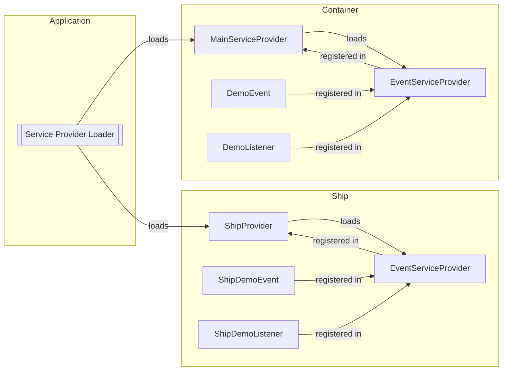

Apiato events are just [Laravel Events](https://laravel.com/docs/events),
and they function in the exact same way as Laravel events.
However, they come with additional rules and conventions specific to Apiato.

To generate new events and listeners, you may use the following interactive commands:

```
php artisan apiato:generate:event
php artisan apiato:generate:listener
```

## Rules

- All 
  - Events MUST extend the `App\Ship\Parents\Events\Event` class.
    - The parent extension SHOULD be aliased as `ParentEvent`.
  - Listeners MUST extend the `App\Ship\Parents\Listeners\Listener` class.
    - The parent extension SHOULD be aliased as `ParentListener`.
- All container-specific
  - Events MUST be placed in the `app/Containers/{Section}/{Container}/Events` directory.
  - Listeners MUST be placed in the `app/Containers/{Section}/{Container}/Listeners` directory.
- All general
  - Events MUST be placed in the `app/Ship/Events` directory.
  - Listeners MUST be placed in the `app/Ship/Listeners` directory.
- Listeners CAN listen to all cross-container & cross-section events.
- Events & Listeners MUST be registered in the location where you intend to handle that event.
  - If you intend to handle an event in:
    - A container, the Listener MUST be registered in `App\Containers\{Section}\{Container}\Providers\EventServiceProvider` class.
    - The Ship, the Listener MUST be registered in `App\Ship\Providers\EventServiceProvider` class.

## Folder Structure

The highlighted sections showcase event & listener registration points:

```php
app
├── Containers
│   └── Section
│       └── Container
│           ├── Events
│           │   ├── DemoEvent.php
│           │   └── ...
│           ├── Listeners
│           │   ├── DemoListener.php
│           │   └── ...
│           └── Providers
                // highlight-start
│               ├── EventServiceProvider.php
                // highlight-end
│               └── ...
└── Ship
    ├── Events
    │   ├── ShipDemoEvent.php
    │   └── ...
    ├── Listeners
    │   ├── ShipDemoListener.php
    │   └── ...
    └── Providers
        // highlight-start
        ├── EventServiceProvider.php
        // highlight-end
        └── ...
```

## Code Example

Events and Listeners are defined exactly as you would define them in Laravel.

## Registering Events & Listeners

The registration of events and listeners depends on where you intend to respond to events.
Listeners can be registered in both Containers and Ship Events Service Providers.

### Manually Registering Events

#### In The Container

Registering events and listeners in the container can be done
by adding them to the `listen` array in the `App\Containers\{Section}\{Container}\Providers\EventServiceProvider` class.

```php
use App\Ship\Parents\Providers\EventServiceProvider as ParentEventServiceProvider;

class EventServiceProvider extends ParentEventServiceProvider
{
    protected $listen = [
        OrderShipped::class => [
            SendShipmentNotification::class,
        ],
    ];
}
```

To generate an event service provider
you may use the `apiato:generate:provider` interactive command:

```
php artisan apiato:generate:provider
```

Remember to also register the `EventServiceProvider` in the container's `MainServiceProvider`:

```php
use App\Ship\Parents\Providers\MainServiceProvider as ParentMainServiceProvider;

class MainServiceProvider extends ParentMainServiceProvider
{
    protected array $serviceProviders = [
        EventServiceProvider::class,
    ];
}
```

#### In The Ship

Registering events and listeners in the Ship can be done
by adding them to the `listen` array in the `App\Ship\Providers\EventServiceProvider` class.

### Event Discovery
> Available since Core v8.15.0

Instead of registering events and listeners manually in the `$listen` array of the `EventServiceProvider`s,
you can enable Laravel's [automatic event discovery](https://laravel.com/docs/events#event-discovery).
When event discovery is enabled,
Apiato will automatically find
and register your events and listeners
by scanning your application's `app/Containers/{Section}/{Container}/Listeners` directory.
In addition, any explicitly defined events listed in the `EventServiceProvider`s will still be registered.

Event discovery is enabled by default,
but you can disable it by overriding the `shouldDiscoverEvents` method of your Container's `EventServiceProvider`:

```php
/**
 * Determine if events and listeners should be automatically discovered.
 */
public function shouldDiscoverEvents(): bool
{
    return false;
}
```

## Events & Listeners Registration Flow

If you are manually registering events and listeners and wish to understand the registration process,
here is a breakdown of the registration flow.

Consider the following folder structure:

```php
app
├── Containers
│   └── Section
│       └── Container
│           ├── Events
│           │   ├── DemoEvent.php ────►─┐
│           │   └── ...                 │
│           ├── Listeners               │
│           │   ├── DemoListener.php ─►─┤
│           │   └── ...                 │
│           └── Providers               ▼
│               ├── EventServiceProvider.php ─────────►─────────┐
│               ├── MainServiceProvider.php ◄───registered─in─◄─┘
│               └── ...
└── Ship
    ├── Events
    │   ├── ShipDemoEvent.php ──►─┐
    │   └── ...                   │
    ├── Listeners                 │
    │   ├── ShipDemoListener.php ►┤
    │   └── ...                   │
    └── Providers                 ▼
        ├── EventServiceProvider.php ─────────►─────────┐
        ├── ShipProvider.php        ◄───registered─in─◄─┘
        └── ...
```

The following diagram illustrates the registration flow of events and listeners in the above folder structure:



